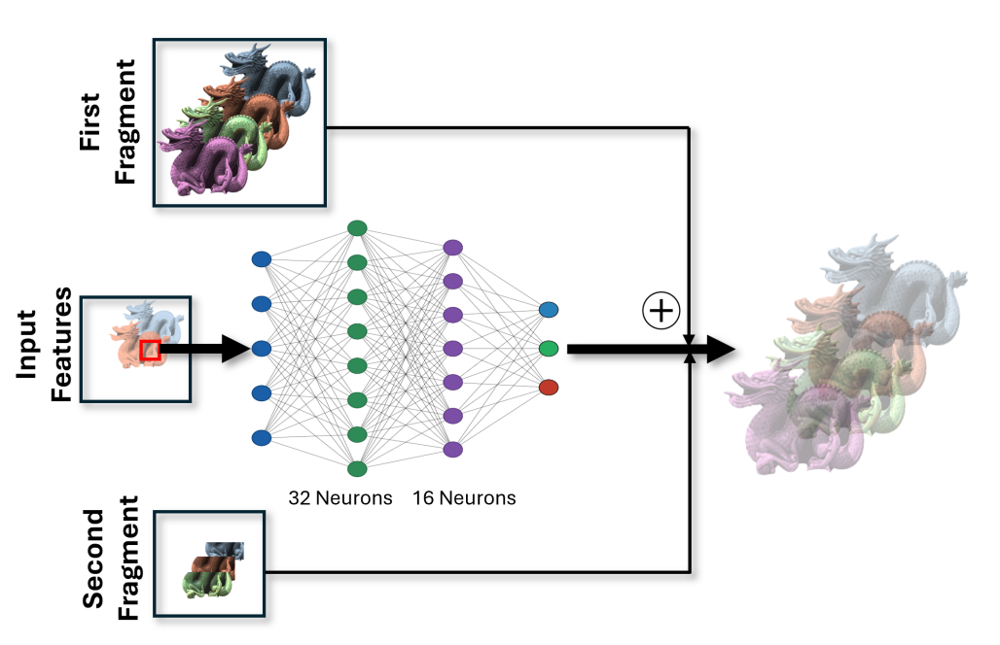

## STAR-NT: Spatiotemporal Acceleration of Real-Time Neural Transparency Rendering

This repository contains an implementation of "STAR-NT: Spatiotemporal Acceleration of Real-Time Neural Transparency Rendering", by Tsopouridis et al. STAR-NT introduces a dual-domain acceleration framework for neural order-independent transparency (OIT) that exploits both spatial and temporal coherence, using an adaptive quadtree to drive mixed-resolution geometry passes, and temporal reprojection, achieving substantial performance improvements while preserving the visual quality of neural transparency rendering across desktop and mobile platforms. 

📄 **Paper:** https://arxiv.org/abs/2606.16747, to appear in LNCS (proc. of Computer Graphics International 2026).
